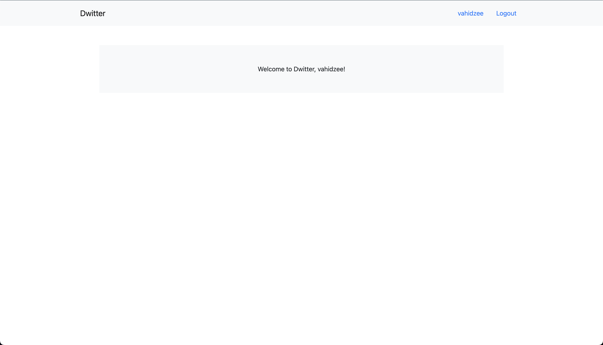
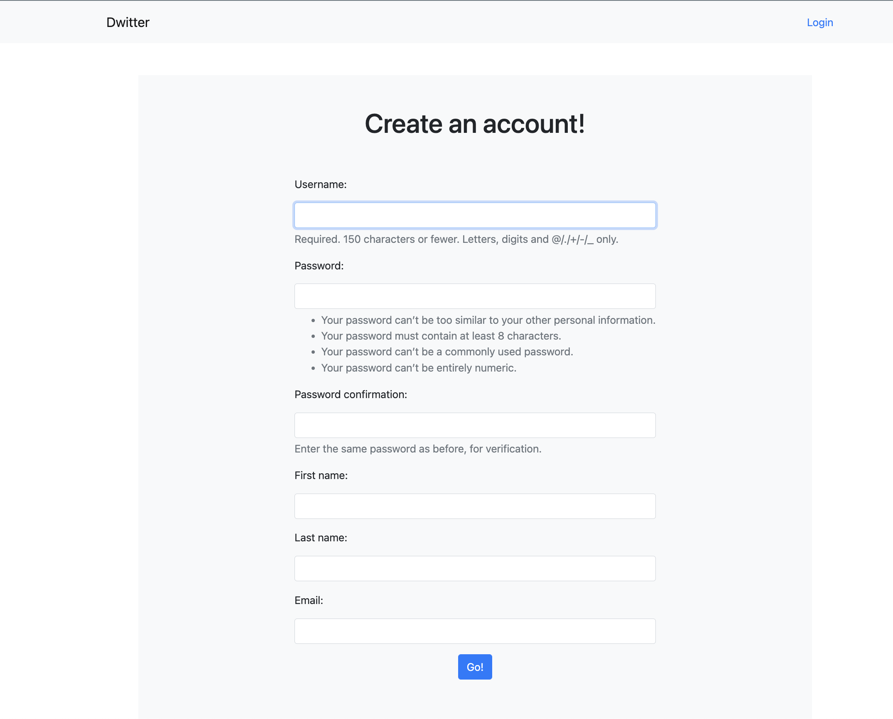
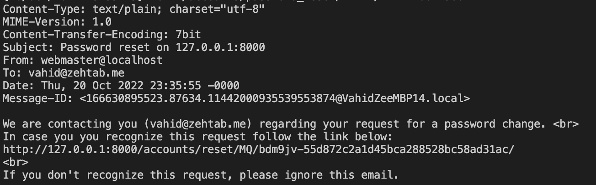
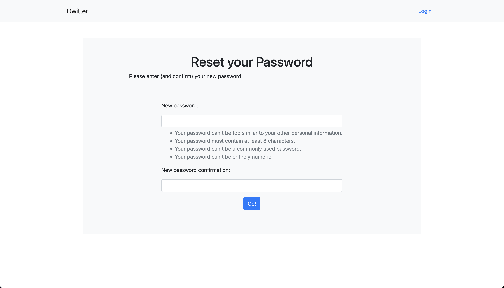

# Django Tutorials CSC309

To practice the essensial functionalities of Django, we will be building a dummy twitter application (hence Dwitter).
For now we will focus on modeling user profiles and authentication. 

This week we will be building the following features:
- User login, logout, and password reset
- User registration
- Landing page (home page)
- User management admin page

Our final product will look like this:
- **Landing page**: Because we are only focusing on user management this week, the landing page will be a simple page that displays the current user's username. If the user is not logged in, the page will not open, and be automatically redirected to the login page. Next week we will add a list of tweets to the landing page.



- **Login page**: The login page will have a form that takes in the user's username and password. If the user is not registered, the page will display an error message. If the user is registered, the page will redirect the user to the originally intended page (or the landing page as default). Here we also have a link to the password reset page, and a link to the registration page.


After loggin in, users username will be displayed on the navigation bar, beside the logout button.
We will implement the profile page (which will be displayed when the user clicks on their username on the navigation bar) next week. If the user logs out, the navigation bar will revert to the original state and user will see a page that says "You logged out".


- **Registration page**: The registration page will have a form that takes in the user's basic information. In case there are no errors (e.g. username already exists), the page will redirect the user to the login page.


  
- **Password reset page**: The password reset page will have a form that takes in the user's email. Regardless of whether the email is registered or not, the page will display a success message stating that "If there exist an account associated with your email, we have sent you instructions on how to recover your password". If the email is actually registered, after the user submits the form, we will send them an email in the background, containing a link to the password reset confirmation page.


We will only print the email to the console for now, and it will look like this:


After clicking on the link, the user will be redirected to the password reset confirmation page, where they can enter their new password. After submitting the form, the user will be redirected to the login page.


And if an incorrect link (or previously used) is clicked, an error message will be displayed instead of the password reset confirmation page.


---

## Part 1: Setup

You can either use the boilerplate code provided in this repository or start from scratch.

### Start from scratch

Install Django and create a new project:
```bash
pip install django
django-admin startproject dwitter
```

Create two new applications `tweets` and `accounts`, and add them to the `INSTALLED_APPS` in settings.py. You can either follow the structure of this repository and have your apps in a folder called "apps", or you can just put them in the root of your project. 

`tweets` will be responsible for handling tweets, and `accounts` will be responsible for handling user profiles, social interactions and authentication. 

In this session we will be focusing on the `accounts` app.

### Run the project

After setting up the project, first you need to tell django to create the database. Django uses migrations to keep track of changes to the database, by running the following commands, django will look out for changes in the data models (in `models.py` of `INSTALLED_APPS`) and apply them to the database, which in this case will create a brand new sqlite database. 

```bash
python manage.py makemigrations # creates migrations for the apps in INSTALLED_APPS
python manage.py migrate # creates the database (or updates it if it already exists)
```

Then you can run the server:
```bash
python manage.py runserver
```

---

## Part 2: Account Features

### User model

Django provides a default user model (with essensial data fields that we need for this project). We can also extend this model to add more fields to it in the future. 

You can find the default user model in `django.contrib.auth.models.User`, it is usually suggested to extend this model instead of creating a new one. Because of this, it is usually suggested not to import the model directly, but instead use `django.contrib.auth.models.get_user_model()` to get the instance of the user model that is currently active in this project.

As a side note, In case you needed to create a new model for a future project, you can find more information [here](https://docs.djangoproject.com/en/4.0/topics/auth/customizing/#substituting-a-custom-user-model).

### User Registration System
Django provides a built-in authentication system that handles user login, logout, and password change. It also provides a set of forms and views that you can use to setup your website's authentication system (check out [here](https://docs.djangoproject.com/en/4.1/topics/auth/default/) for more information). 
For our project these default abstractions cover everything we are looking for. Therefore, we won't reinvent the wheel and implement **Login**, **Logout** and **Password Change** using Django built-in functionalities.

In order to use the authentication system, you need to add `django.contrib.auth` to your `INSTALLED_APPS` setting (which is usually there by default), and include the `django.contrib.auth.urls` URLconf in your project `urls.py` file to make use of its built-in views.


To add a set of urls into your project, you can use the `django.urls.include` function without the need for explicitly importing your intended url module. So your `urls.py` file should look something like this:

```python
# dwitter/urls.py
from django.urls import include  
urlpatterns = [
    path("accounts/", include("django.contrib.auth.urls")),  # ADDITION: include the default auth urls
]
```

This will include the following URL patterns:

```
accounts/login/ [name='login']
accounts/logout/ [name='logout']
accounts/password_change/ [name='password_change']
accounts/password_change/done/ [name='password_change_done']
accounts/password_reset/ [name='password_reset']
accounts/password_reset/done/ [name='password_reset_done']
accounts/reset/<uidb64>/<token>/ [name='password_reset_confirm']
accounts/reset/done/ [name='password_reset_complete']
```

But if you visit any of these URLs (after running the development server), you'll get a `TemplateDoesNotExist` error. This is because, although Django provides these views, we are in charge of providing the templates that will be used to render them. In order to do that, we need to create the following templates in `templates/registration` folder (and we also need to add `templates` to the `DIRS` list in `TEMPLATES` in `settings.py`):

- `login.html`: The login page. Context has a `form` variable that you can use to render the login form.
- `logout.html`: The logout page. (Just a message saying "You have been logged out." and a link to the login page should suffice.)
- `password_reset_form.html`: The password reset page. Context has a `form` variable that you can use to render the password reset form.
- `password_reset_email.html`: The email template for the password reset email. Context has `protocol` `domain` `uid` `token` which you can use to construct the password reset link. 
- `password_reset_done.html`: The password reset done page. (Just a message saying "We've emailed you instructions for setting your password, if an account exists with the email you entered. You should receive them shortly." and a link to the login page should suffice.)
- `password_reset_confirm.html`: The password reset confirmation page. Context has a `form` variable that you can use to render the password reset confirmation form (which asks for the new password).
- `password_reset_complete.html`: The password reset complete page. (Just a message saying "Your password has been set. You may go ahead and log in now." and a link to the login page should suffice.)

By providing these templates, we will have implemented the **Login**, **Logout** and **Password Change** features.

#### Base template
Django template has tons of useful tricks and features which makes it easy to create website that follow a base structure. For example, you can define a base overall template for your website (which defines the location of your navigation bar, content and etc.) and use the `` tag to extend your base template, and providing `` tag to define a block that will be replaced by the content of the child template. You can find more information about Django templates [here](https://docs.djangoproject.com/en/4.1/topics/templates/).

A general [Bootstrap 5](https://getbootstrap.com/docs/5.0/getting-started/introduction/) enabled template is provided in [`templates/base.html`](https://github.com/vahidzee/csc309/dwitter/templates/base.html) file. You can use it as a base template for your website. This template assumes that your child template will provide a `page_content` block, which will be rendered in the main content area of the website. 

##### Navigation Bar
Navigation bar is a common feature in most websites. In order to make it easier to implement, we have provided a navigation bar template in `templates/nav.html`, and included it in the base template. You can use this template in your child templates by using the `` tag. To complete the navigation bar implementation, fill in the black spots in the `nav.html` template, so that when a user is logged in, the navigation bar will show the user's username and a link to logout API, and when a user is not logged in, the navigation bar will show a link to the login page. 

In order to check if a user is logged in, you can use the `user.is_authenticated` variable in your Django templates. The `user` context variable will have the information of the logged-in user such as its `username` as well (`user.username`) For example, you can use the following code to show the user's username and a link to logout API if the user is logged in, and show a link to the login page if the user is not logged in:

```html

    <li class="nav-item">
        <a class="nav-link" href="">{{ user.username }}</a>
    </li>

    <li class="nav-item">
        <a class="nav-link" href="">Login</a>
    </li>

```

### Optional Generic Form Template
If you look closely, you will notice that, we need to implement at least three pages for a `form` context and the rest showing some message. So we can create a base template for forms and showing messages, and extend it in our templates. This will make our code more readable and easier to maintain. 

In order to do that, you can create a `templates/generic_form.html` file that renders a form page given a context with `form` and `action` variables. You can use the following code as a starting point:

```html



<!-- block for form header to extend in other templates-->
  
<form method="post" action="{{ action }}">
    
    {{ form.as_p }}
    <button type="submit" class="btn btn-primary">Submit</button>
</form>

```

Althogh this template suffices for rendering any form, you can add bootstrap classes to the form elements to make it look better. You can find more information about bootstrap forms [here](https://getbootstrap.com/docs/5.0/forms/overview/). To add boostrap to your form, instead of relying on the default Django form rendering (`{{form}}` or `{{form.as_p}}`), you can iterate over the form fields and render them as you wish.

There is also a plathera of 3rd party libraries that can help you with rendering forms. For example, you can use [django-crispy-forms](https://django-crispy-forms.readthedocs.io/en/latest/) to render your forms in a more elegant way. You can also use [django-widget-tweaks](https://github.com/jazzband/django-widget-tweaks) to add custom classes to your form elements.

### Optional Generic Message Template
You can also create a `templates/generic_message.html` file that renders a content (either in the context or as a block). You can use the following code as a starting point:

```html



 
    <p>{{ content }}</p>

     


```
This template will render the content of the `content` variable in the context, or the content of the `content` block if the `content` variable is not provided (therefore expects to be extended by a child template that provides a content block instead).

### Implementing the Registration Templates

1. **Log in**: Either make your own form template or use your generic_form template to create the login page template in `templates/registration/login.html`. To add links to other pages, you can use the `` template tag. For example, to link to the password reset page, you can use ``. You can find more information about the `` template tag [here](https://docs.djangoproject.com/en/4.1/ref/templates/builtins/#url).

2. **Log out**: Create the logout page template in `templates/registration/logout.html` either by extending your generic_message template or from scratch. You can use the `` template tag to link to the login page (API name `login`).

3. **Password Reset Form**: Similar to the login page, create the password reset form page template in `templates/registration/password_reset_form.html` either by extending your generic_form template or from scratch.
4. **Password Reset Email**: Create the password reset email template in `templates/registration/password_reset_email.html` using the mentioned context variables. The password reset link will be of the form `<protocol>://<domain>/<password_reset_confirm url>/<uidb64>/<token>/`. You can use the `` template tag to create the link. For example, to create the link to the password reset confirmation page, you can use ``. Therefore in your template, you can use the following code to create the link:
    ```html
    ...
    {{ protocol }}://{{ domain }}
    ...
    ```

5. **Password Reset Done**: Create the password reset done page template in `templates/registration/password_reset_done.html` either by extending your generic_message template or from scratch. 

6. **Password Reset Confirm**: Create the password reset confirmation page template in `templates/registration/password_reset_confirm.html` either by extending your generic_form template or from scratch. In addition to the `form` and `action` context variables, a `validlink` context variable is also provided. You can use this variable to show a message if the link is not valid, or to show the form if the link is valid.
7. **Password Reset Complete**: Create the password reset complete page template in `templates/registration/password_reset_complete.html` either by extending your generic_message template or from scratch.
---
## Part 3: Implementing the Signup 

1. Django provides a `UserCreationForm` class that can be used to create a user. You can find more information about this class [here](https://docs.djangoproject.com/en/4.1/topics/auth/default/#django.contrib.auth.forms.UserCreationForm). We wish for our signup page to also gather the user's first name and last name and email, which are not provided by the `UserCreationForm` class. Therefore, we will create a new form class that inherits from the `UserCreationForm` class and adds the required fields in `accounts/forms.py`.
2. Now that we have a form class, we need to create a view that renders the form and handles the form submission. Create a `signup` view in `accounts/views.py` that renders the form and handles the form submission. You can use `django.views.generic.edit.FormView` which does this automatically for you. You can find more information about this class [here](https://docs.djangoproject.com/en/4.1/topics/class-based-views/generic-editing/#formview). 

    If you are using the `FormView` class, you can just provide the `generic_form.html` that you implemented in the previous part as the `template_name` attribute. Remember that we want to show the login page after the user signs up, so you can set the `success_url` attribute to redirect the user to the login page after the form is submitted successfully. To avoid hardcoding the login page URL, you can use the `django.urls.reverse_lazy` function to get the URL of the login page. You can find more information about this function [here](https://docs.djangoproject.com/en/4.1/ref/urlresolvers/#reverse-lazy).

3. Finally, we need to create a URL pattern for the signup page. Create a `signup` URL pattern in the `dwitter/urls.py` that maps the `signup` view to the `signup` URL. You can also name this view `signup` so that you can easily use the `` template tag to link to the signup page in the login page template.

---  
## Part 4: The Landing Page

1. For now just create a view in `tweets/views.py` that greets the user in case they are logged in, otherwise redirects them to the login page. In case you wish to implement this as a function-based view, you can use the `django.contrib.auth.decorators.login_required` decorator, to handle the redirection. You can find more information about this decorator [here](https://docs.djangoproject.com/en/4.1/topics/auth/default/#the-login-required-decorator).
2. Link your view to the root URL pattern in `dwitter/urls.py` so that the user is redirected to the landing page when they visit the root URL ("").

---
## Part 5: The admin page
We don't do much this week with the admin page, but we will use it in the future. Therefore, we will just set it up now.

1. Create a superuser account by running `python manage.py createsuperuser`. You can use this account to log in to the admin page.
2. Customize the admin pages' header and name by adding the following code to one of `accounts` or `tweets` apps' `admin.py` file:
    ```python
    from django.contrib import admin

    admin.site.name = "Dwitter Admin"
    admin.site.site_header = "Dwitter"
    admin.site.site_title = "Dwitter Admin Portal"
    admin.site.index_title = "Welcome to Dwitter Admin Portal"
    ```

3. Because we won't be using Django's groups, we will remove the groups and permissions from the admin page. To do this, add the following code `account/admin.py` file:
    ```python
    from django.contrib import admin
    from django.contrib.auth.models import Group

    admin.site.unregister(Group)
    ```
    